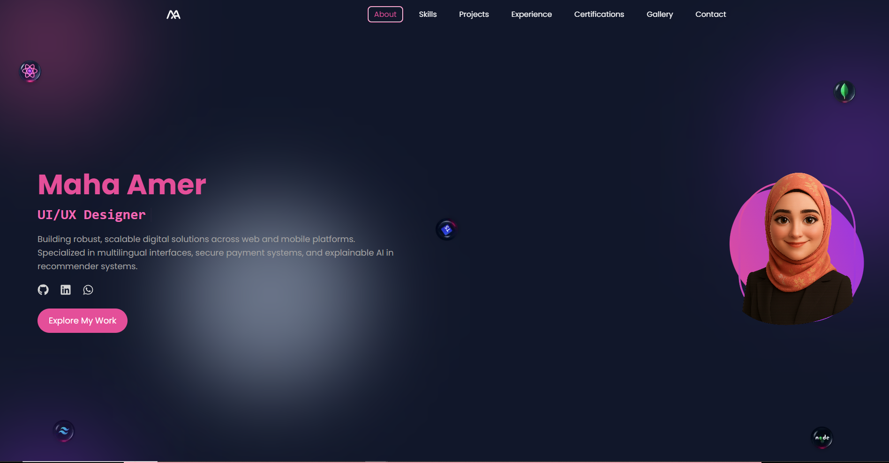
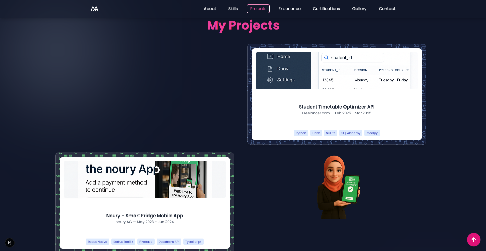
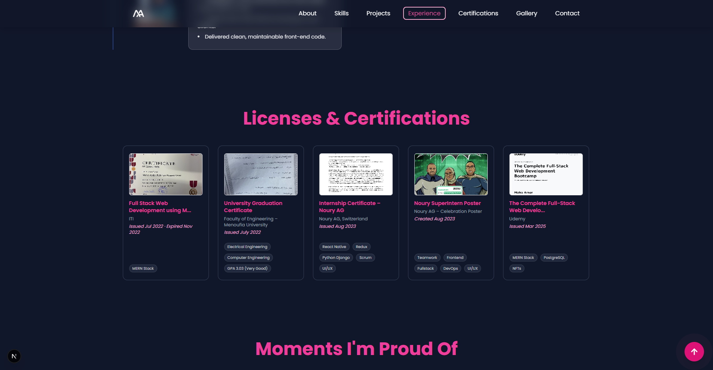

# 💼 Maha Amer – Developer Portfolio

Welcome to my personal portfolio website built with **Next.js**, **Tailwind CSS**, and **Framer Motion**. This portfolio showcases my latest projects, skills, certifications, and professional experience as a **Full-Stack JavaScript Developer** with a focus on **React** and **React Native** development.

> Live Website: ([https://mahaamer.vercel.app](https://maha-portfolio-six.vercel.app/))

---

## ✨ Features

- ✅ Responsive, modern UI with **Framer Motion** animations
- ✅ Interactive slider for certifications and skills
- ✅ Projects gallery with detailed tech stacks
- ✅ Contact form integration (email-friendly)
- ✅ Dark mode ready (optional)
- ✅ Optimized for SEO and performance

---

## 📸 Screenshots

| Home Page                          | Projects Section                     | Certifications Section               |
|-----------------------------------|--------------------------------------|--------------------------------------|
|  |  |  |

> 📁 **Note:** Place your screenshots inside `public/screenshots/` directory in your project folder.

---

## 🚀 Tech Stack

- **Frontend:** Next.js, React, Tailwind CSS, Framer Motion
- **Design:** Figma, Photoshop
- **State Management:** useState, useEffect, Context API
- **Deployment:** Vercel

---

## 🛠️ Installation & Development

```bash
# 1. Clone the repo
git clone https://github.com/mahaamer/myPortfolio.git

# 2. Navigate to the folder
cd myPortfolio

# 3. Install dependencies
npm install

# 4. Run development server
npm run dev
